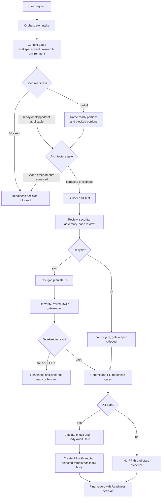
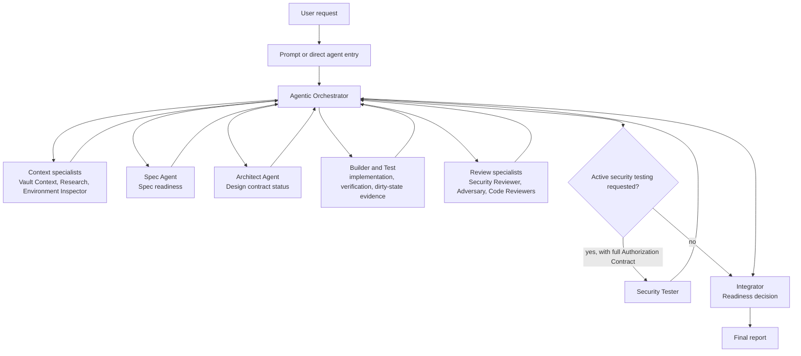
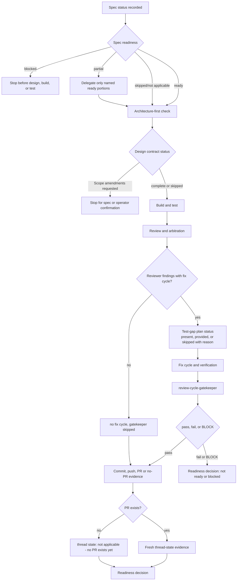
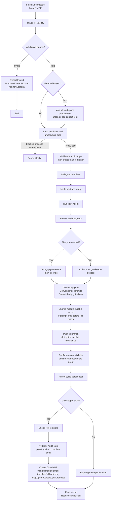
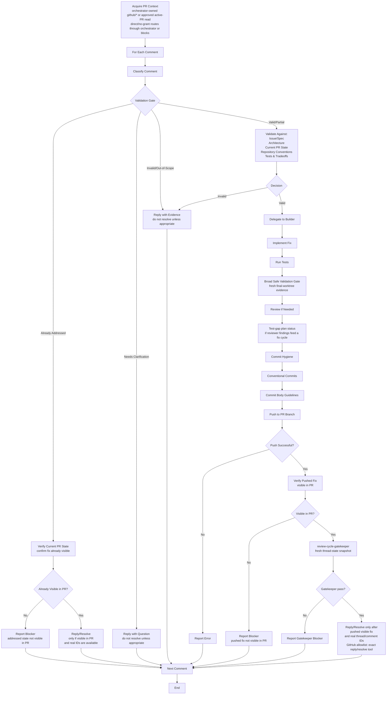
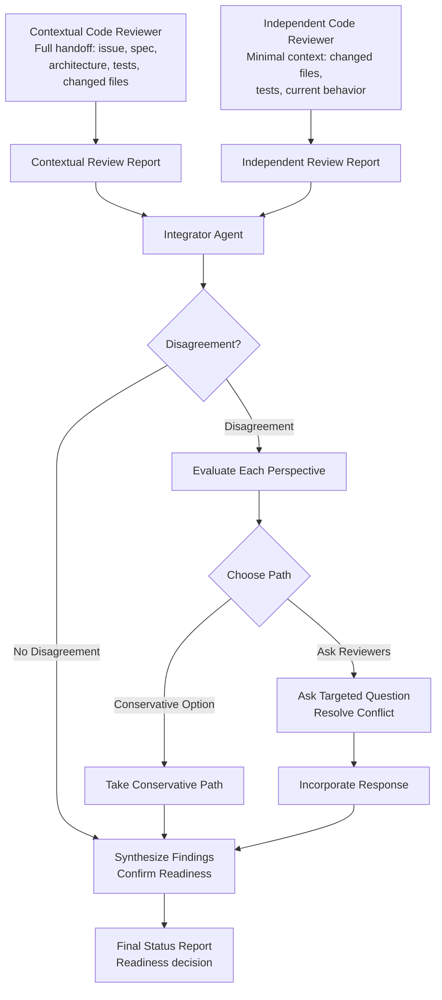
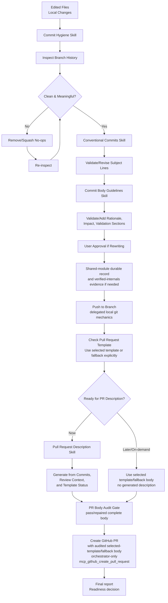

# Agentic Engineering Pack Guide

This guide documents the VS Code/GitHub Copilot customization pack for agentic engineering workflows. The pack coordinates specialist agents (orchestrator, spec, architect, builder, test, reviewers, security tester, and integrator) to turn engineering requests into verified, reviewed, and integrated results. All customizations live under `.github/` at the workspace level.

## How It Works

The simplest mental model: one orchestrator controls the workflow, delegates scoped work to specialist agents, enforces gates, and returns a final report.

The orchestrator owns workflow control and MCP integration. It decides which agent runs next, tracks gate outcomes, keeps Linear and GitHub access centralized through `linear/*` and `github/*`, and delegates private Obsidian project-note reads to a narrow vault specialist. Specialist-owned work requires an actual specialist or skill invocation with returned output, failure, or blocked status; a visible handoff log alone is not delegation. Linear/GitHub namespace-level grants are orchestrator-only because they include mutation tools and are not an enforceable read-only model for specialists. Obsidian vault context uses exact read-only tool grants instead of a broad namespace.

Specialist agents are isolated by role and tool permissions. Builder and Test are edit-capable for implementation and verification work, while reviewers are read-only by default so they can evaluate outcomes independently. Research handles public web facts from orchestrator-provided context without local read/search/execute, and Environment Inspector handles read-only local tooling plus repository state/history reconnaissance without web or edit. Vault Context handles narrow Obsidian project-note context with exact read-only tools, provenance, and read/not-read boundaries. No specialist has automated VS Code workspace-folder command access; outside-workspace repositories require the operator to open or add the correct folder manually before work proceeds. Specialists receive any needed Linear/GitHub/vault context as distilled orchestrator handoffs, not by direct broad namespace access. Each skill or agent handoff is logged visibly with purpose, expected output, and out-of-scope boundaries.

Skills act as reusable procedures and quality gates, not broad permission grants. A skill can standardize steps like commit hygiene or PR comment handling, but it does not override each agent's tool boundaries.

The workflow is gate-based: clarify readiness, gather context, run spec and architecture gates when triggered, implement, test, review, convert reviewer findings into a test-gap plan when a fix cycle follows, clean commits, push through delegated local git mechanics, confirm remote visibility, close review rounds through the gatekeeper, check the Pull Request Template, audit the complete selected-template/fallback PR body, and create PRs through orchestrator-only `mcp_github_create_pull_request` when the PR path is active. No-PR paths still report thread-state evidence, such as `thread state: not applicable - no PR exists yet`, instead of pretending the PR surface was checked. Before any push or PR path involving commits, `commit-hygiene`, `conventional-commits`, and `commit-body-guidelines` are mandatory; unavailable commit skills block push/PR and produce local-status or PR-ready output instead.

High-risk agent-pack changes touching orchestrator workflow rules, tool grants, security boundaries, security-tester authorization, or multiple agent files require contextual plus independent review, or an explicit skip rationale/deference recorded before commit hygiene and PR readiness.

The final report carries a first-class `Readiness decision: blocked | partial | ready | not ready`. `ready` requires complete specialist outputs, verification/check evidence, review/arbitration evidence, gatekeeper evidence or the explicit `no fix cycle, gatekeeper skipped` sentinel, thread-state freshness or no-PR proof, PR/template evidence when applicable, and explicit not-applicable rationales for skipped gates.

PR description generation is intentionally final and on-demand. It is produced when changes are stable, not at the start of implementation.

The user-facing composer remains `pull-request-description`. It invokes internal support skills `pr-description-template-policy` and `pr-description-body-audit` for template policy and final body audit; those support skills are marked `user-invocable: false` and should not be selected directly by users.



## Specialists

Specialists are role-isolated agents selected by the orchestrator based on the work needed.

- Spec: requirements and Acceptance criteria.
- Vault Context: narrow read-only Obsidian project-note context with provenance and read/not-read boundaries.
- Research: external public facts, official docs, standards, release notes, advisories, vendor docs, package docs, and product/domain research.
- Environment Inspector: read-only local tooling, package script, dependency tree, package manager, toolchain, and repository state/history reconnaissance.
- Architect: design, interfaces, tradeoffs.
- Builder: production edits, focused implementation.
- Test: test changes and verification.
- Security Reviewer: security/privacy/trust boundary review.
- Security Tester: active security testing against an explicitly authorized deployed or running target.
- Adversary: assumptions, edge cases, failure modes.
- Contextual Code Reviewer: full-context review against plan and Acceptance criteria.
- Independent Code Reviewer: minimal-context review to avoid implementation anchoring.
- Integrator: synthesizes findings, arbitrates conflicts, reports readiness.

Builder and Test are edit-capable; reviewers are read-only by default.

Builder and Test can perform local branch/commit/push git state/history mutations only when explicitly requested by a workflow or user and after the `workflow-safety-gates` git preflight and Local Git Mutation Delegation Contract pass. PR creation is orchestrator-only via `mcp_github_create_pull_request` after readiness evidence is present. Their direct-entry files still include local hard stops for missing critical parameters, ambiguous repo/branch scope, broad staging without inspection and approval, default/base pushes, pushed/shared history rewrites without approval, and mutating probes.

## Components

### Distribution Bundle

Generate an installable Copilot plugin directory with:

```bash
node scripts/generate-copilot-plugin.mjs --clean
```

The generator outputs an installable plugin directory (default: `dist/agentic-engineering-pack`) for reuse across repositories or release artifacts. Install it with `copilot plugin install ./dist/agentic-engineering-pack`.

Prompt files in `.github/prompts/*.prompt.md` are converted into plugin command files under `commands/`, because prompts are not plugin components.

It does not produce a VSIX or Marketplace extension package.

### Agents

| Agent | Responsibility | Tool Class |
| --- | --- | --- |
| [Orchestrator](../../.github/agents/agentic-engineering-orchestrator.agent.md) | Coordinates workflow, delegates to specialists, ensures gates and verification. | `read`, `search`, `agent`, `todo`, `vscode/askQuestions`, `linear/*`, `github/*`, `github.vscode-pull-request-github/activePullRequest`, `github.vscode-pull-request-github/resolveReviewThread` |
| [Vault Context](../../.github/agents/vault-context-agent.agent.md) | Retrieves narrow read-only Obsidian vault context and returns distilled summaries with provenance and read/not-read boundaries. | Exact Obsidian read-only tools only |
| [Research](../../.github/agents/research-agent.agent.md) | Gathers external public facts from orchestrator-provided context when repository context is insufficient. | `web` |
| [Environment Inspector](../../.github/agents/environment-inspector-agent.agent.md) | Performs read-only local tooling, package script, dependency tree, toolchain, and repository state/history reconnaissance. | `read`, `search`, `execute` |
| [Spec](../../.github/agents/spec-agent.agent.md) | Clarifies requirements, Acceptance criteria, scope, and ambiguities. | `read`, `search`, `vscode/askQuestions` |
| [Architect](../../.github/agents/architect-agent.agent.md) | Designs implementation approach, tradeoffs, data flow, and interfaces. | `read`, `search`, `web` |
| [Builder](../../.github/agents/builder-agent.agent.md) | Implements focused production changes following project style. | `read`, `search`, `edit`, `execute` |
| [Test](../../.github/agents/test-agent.agent.md) | Plans tests, implements test changes, runs verification. | `read`, `search`, `edit`, `execute`, `browser` |
| [Security Reviewer](../../.github/agents/security-reviewer-agent.agent.md) | Reviews security, privacy, and trust boundary risks through static code/config review. | `read`, `search` |
| [Security Tester](../../.github/agents/security-tester-agent.agent.md) | Performs active security testing against authorized deployed/running targets under an Authorization Contract. | `read`, `search`, `execute`, `web` |
| [Adversary](../../.github/agents/adversary-agent.agent.md) | Challenges assumptions and discovers failure modes. | `read`, `search` |
| [Code Reviewer (Contextual)](../../.github/agents/code-reviewer-agent.agent.md) | Reviews code against plan, intent, and Acceptance criteria; checks correctness and regressions. | `read`, `search` |
| [Code Reviewer (Independent)](../../.github/agents/independent-code-reviewer-agent.agent.md) | Reviews with minimal implementer context to find bugs and missing tests. | `read`, `search` |
| [Integrator](../../.github/agents/integrator-agent.agent.md) | Synthesizes specialist findings and readiness, resolves conflicts, reports final status. | `read`, `search`, `todo` |

### Skills

| Skill | When to Use |
| --- | --- |
| [Expert Panel](../../.github/skills/expert-panel/SKILL.md) | Running a multi-agent panel for complex engineering decisions, architecture review, or implementation planning. |
| [Adversarial Review](../../.github/skills/adversarial-review/SKILL.md) | Performing adversarial review, red-team analysis, edge-case discovery, and failure-mode analysis. |
| [Workflow Safety Gates](../../.github/skills/workflow-safety-gates/SKILL.md) | Applying shared workflow safety gates for critical parameters, exact-tool remote mutation allowlists, Obsidian vault context, remote MCP context, branch/git preflight and delegation contracts, PR templates, and PR review visibility/thread resolution. |
| [Linear Issue Workflow](../../.github/skills/linear-issue-workflow/SKILL.md) | Fetching Linear issues, triaging validity, creating branches, fixing issues, and creating GitHub PRs. |
| [PR Review Comments Workflow](../../.github/skills/pr-review-comments-workflow/SKILL.md) | User-invocable coordinator for GitHub PR review comments: context, validation, fix cycle, closure, reply/resolve. |
| [PR Review Thread Context](../../.github/skills/pr-review-thread-context/SKILL.md) | Internal active PR/review-thread context and real-ID acquisition. |
| [PR Review Comment Validation](../../.github/skills/pr-review-comment-validation/SKILL.md) | Internal evidence-based PR review comment classification. |
| [PR Review Fix Cycle](../../.github/skills/pr-review-fix-cycle/SKILL.md) | Internal Builder/Test, verification, Broad Safe Validation Gate, commit, push, and visibility contract. |
| [PR Review Round Closure](../../.github/skills/pr-review-round-closure/SKILL.md) | Internal review-cycle gatekeeper handoff preparation. |
| [PR Review Reply Resolve](../../.github/skills/pr-review-reply-resolve/SKILL.md) | Internal reviewer-facing reply and thread-resolution contract. |
| [Commit Hygiene](../../.github/skills/commit-hygiene/SKILL.md) | Preparing branch history for push/PR; removing no-op commits; ensuring commits are atomic and meaningful. |
| [Conventional Commits](../../.github/skills/conventional-commits/SKILL.md) | Writing, validating, or revising Conventional Commit subject lines for pending or recent commits. |
| [Commit Body Guidelines](../../.github/skills/commit-body-guidelines/SKILL.md) | Enforcing structured commit bodies with Rationale, Impact, and Validation sections. |
| [Pull Request Description](../../.github/skills/pull-request-description/SKILL.md) | Generating copy/pasteable PR descriptions from branch commits and review context; on-demand only. |
| [Review Cycle Gatekeeper](../../.github/skills/review-cycle-gatekeeper/SKILL.md) | Closing review/fix cycles by validating findings, fix evidence, thread state, and merge-readiness blockers. |
| [Test Gap to Test Plan](../../.github/skills/test-gap-to-test-plan/SKILL.md) | Converting reviewer findings or identified test gaps into prioritized must-have test cases. |

### Prompts

| Prompt | Entry Point |
| --- | --- |
| [Run Agentic Engineering](../../.github/prompts/run-agentic-engineering.prompt.md) | Orchestrates full workflow from a user request; delegates to specialist agents for specification, architecture, build, test, and review. |
| [Run Linear Issue Workflow](../../.github/prompts/run-linear-issue-workflow.prompt.md) | Fetches and fixes Linear issues end-to-end with agentic workflow; creates PR when verified. |

## Orchestration and Delegation

### High-Level Orchestration



### Gate and Readiness Flowchart



### Linear Issue Workflow Flowchart

The push stage is the Push to Branch via delegated local git mechanics step; the diagram wraps the label for readability.



### PR Review Comments Workflow Flowchart



### Dual Review Arbitration Flowchart



### Commit and PR Finalization Flowchart



## Tool and Permission Model

### Frontmatter Tool Grant Format

Agent and prompt `tools:` lists use two complementary forms:

- **Bare capability names** such as `read`, `search`, `edit`, `execute`, `web`, `agent`, `todo`, and `browser` are platform-level capability classes the host grants to the agent. They are the primitives the agent can use directly.
- **Path-style names** such as `linear/*`, `github/*`, `vscode/askQuestions`, and exact VS Code MCP frontmatter grants like `obsidian/get_vault_file_partial` are scoped grants for specific tool surfaces. Wildcard forms (`linear/*`) grant access to an entire MCP namespace; exact names grant only that tool.

Obsidian names have two equivalent notations depending on where they appear: `.agent.md` frontmatter uses VS Code grant names such as `obsidian/search_vault`, while prose, runtime logs, and protocol/tool names use `mcp_obsidian_...` names such as `mcp_obsidian_search_vault`. Both forms can describe exact read-only grants when one tool is listed per line. The forbidden form is the broad wildcard `obsidian/*`, because it grants the whole namespace including mutation tools.

Enforcement model:

- The host enforces tool grants at the agent boundary. An agent that does not list a tool in its `tools:` cannot call it, regardless of prose.
- Namespace-level grants (`linear/*`, `github/*`) include mutation tools and are not treated as enforceable read-only in this pack; only the orchestrator receives them, and only after the Remote MCP Context Gate and the relevant mutation allowlists apply.
- Exact-tool grants (for example the Obsidian read-only allowlist) ARE treated as enforceable read-only, because the granted symbols themselves contain no mutation capability.

The `agents:` frontmatter key (used only on the orchestrator) is documented separately below.

### Frontmatter `agents:` Key

The orchestrator's frontmatter includes a top-level `agents:` list. It enumerates the specialist agent IDs the orchestrator is authorized to invoke through its `agent` tool grant. The list is informational and ordering-insensitive; the host does not currently treat the order as priority. If a specialist agent ID is not in this list, the orchestrator should not invoke it without an explicit user request and a `workflow-safety-gates` review.

### Frontmatter `user-invocable:` Key

Agents and skills declare `user-invocable: true` or `user-invocable: false`. A `true` value means the host may surface the agent or skill in user-facing pickers and the user may invoke it directly. A `false` value means the agent or skill is intended to be invoked only by the orchestrator or by another skill workflow, not selected ad-hoc by the user. The flag is advisory to host UI; it does not enforce tool boundaries.

### Permission Tiers

**Orchestrator Tier** (Coordination & Linear/GitHub Integration)
- Tools: `read`, `search`, `agent`, `todo`, `vscode/askQuestions`, `linear/*`, `github/*`, `github.vscode-pull-request-github/activePullRequest`, `github.vscode-pull-request-github/resolveReviewThread`
- Responsibility: Orchestrates workflow, owns Linear/GitHub remote reads and gated remote mutations, delegates edits to Builder/Test, and passes distilled remote context to specialists.
- Constraint: Does not edit production/test code directly; must verify delegated edits independently. `linear/*` and `github/*` remain orchestrator-only because namespace-level MCP grants include mutation tools and are not a hard read-only boundary. `github.vscode-pull-request-github/activePullRequest` is read-only PR context; `github.vscode-pull-request-github/resolveReviewThread` is allowed only by the exact thread-resolution gate.

**Vault Context Tier** (Exact Read-Only Obsidian Context)
- Tools: frontmatter grants use `obsidian/search_vault`, `obsidian/search_vault_simple`, `obsidian/search_vault_smart`, `obsidian/get_vault_file`, `obsidian/get_vault_file_partial`, `obsidian/get_files_by_tag`, `obsidian/get_backlinks`, `obsidian/get_outgoing_links`, `obsidian/list_vault_files`, and `obsidian/get_server_info`; prose and runtime references use the matching `mcp_obsidian_...` protocol/tool names.
- Responsibility: Retrieves narrow private project-note context from Obsidian, such as ADRs, Acceptance criteria, prior decisions, threat models, and edge cases, then returns distilled summaries with provenance and read/not-read boundaries.
- Constraint: No broad vault wildcard grants such as `obsidian/*`; no mutation, active-file, command, template, attachment, create, update, patch, delete, rename, or side-effect tools. Prefer partial reads, avoid secrets/personal/unrelated notes, do not pass vault content to web tools, and treat vault notes as advisory below user/repo/issue/tests.

**Research Tier** (Public External Facts)
- Tools: `web`
- Responsibility: Gathers public external facts from official docs, standards, release notes, vendor docs, package docs, advisories, or product/domain sources using orchestrator-provided handoff context when repository context is insufficient.
- Constraint: No local read/search, no edits, no shell/execute, no git commands or local repository state/history inspection, no MCP mutations, and no private or sensitive data submitted externally. If local inspection is needed, asks the orchestrator to route it to the relevant local specialist.

**Environment Inspector Tier** (Read-Only Local Reconnaissance)
- Tools: `read`, `search`, `execute`
- Responsibility: Inspects local manifests, scripts, dependency trees, package manager versions, toolchain availability, repository state, and repository history before build/test command selection, dependency-state evaluation, commit hygiene, PR creation, or history-sensitive spec/architecture decisions.
- Constraint: No web, no edits, no git mutations, no package installs/updates/fixes, no service startup, no arbitrary implementation or verification, and explicit user approval before commands that contact external services or submit dependency/environment metadata. `git ls-remote` is an approval-bound network read because it contacts remotes without updating local refs. `git fetch` and `git pull` are not read-only because they update refs and/or the working tree.

**Builder/Test Tier** (Edit-Capable Implementation)
- Tools: `read`, `search`, `edit`, `execute` (plus `browser` for Test)
- Responsibility: Implements production/test changes, runs targeted verification checks.
- Constraint: No pull request creation. PR creation is orchestrator-only via `mcp_github_create_pull_request` after readiness evidence is present. No branches, commits, pushes, or other git state/history mutations unless workflow or user explicitly requests and `workflow-safety-gates` passes; direct-entry hard stops still forbid unsafe git targets, broad staging without inspection and approval, default/base pushes, pushed/shared history rewrites without approval, mutating probes, and hooks in v1.

**Reviewer Tier** (Read/Search)
- Tools: `read`, `search` for reviewers; Integrator also has `todo`.
- Responsibility: Performs read-only review, finds issues, synthesizes findings, and consumes command-backed evidence from Environment Inspector when needed.
- Constraint: No edits, no direct Linear/GitHub MCP access, no web access for Security Reviewer, and no direct command execution. Public CVE, GHSA, vendor advisory, or public security-reference lookups for Security Reviewer route through Research handoffs. Command-backed local inspection routes through Environment Inspector. Specialists rely on orchestrator-provided remote context rather than `linear/*` or `github/*` namespace grants.

**Security Tester Tier** (Active Security Testing)
- Tools: `read`, `search`, `execute`, `web`
- Responsibility: Performs active testing only against deployed or running targets explicitly authorized in the current session.
- Constraint: Never auto-routed, never included in expert panels, and never substituted for Security Reviewer. It requires a complete Authorization Contract before any network activity, registry/supply-chain probing, scanner activity, or command construction.

### MCP Boundaries

| MCP | User | Purpose | Constraints |
| --- | --- | --- | --- |
| `linear/*` | Orchestrator only | Fetch issue context, comments, status, relations, linked PRs, determine triage decisions, propose Linear updates | Namespace-level grant includes mutation tools; not treated as enforceable read-only for specialists. Mutations require the Linear Remote Mutation Allowlist, exact tools/IDs, and explicit user approval. |
| `github/*` | Orchestrator only | Repository metadata, PR metadata/comments/reviews/status reads, PR creation after verification, replies/resolution | Namespace-level grant includes mutation tools; not treated as enforceable read-only for specialists. Mutations require the GitHub Remote Mutation Allowlist. GitHub repository file mutation tools are denied pack-wide. |
| `github.vscode-pull-request-github/activePullRequest` | Orchestrator only | Active PR context in VS Code | Exact read-only extension grant. It does not authorize replies, status changes, thread resolution, branch creation, repository file mutation, PR creation, or other mutation. |
| `github.vscode-pull-request-github/resolveReviewThread` | Orchestrator only | VS Code PR extension review-thread resolution | Exact extension grant allowed only with a real thread ID from extension/GitHub data, pushed-visible fix or verified no-change rationale, gatekeeper pass or allowed skip, and no mutating probe. |
| Exact Obsidian read-only tools | Vault Context Agent only | Narrow private project-note context from Obsidian with provenance and read/not-read boundaries | Frontmatter grants are exact `obsidian/...` entries; prose/runtime names are matching `mcp_obsidian_...` tools. No broad wildcard or mutation/execute/template tools. |
| `web` | Research, Architect, Security Tester | Research public external facts, architecture decisions, or authorized active security testing context | Read-only external documentation lookups for Research/Architect; Security Tester use is governed by the Authorization Contract and must not submit private or sensitive data outside approved scope. Security Reviewer does not have `web`. |
| `execute` | Builder, Test, Environment Inspector, Security Tester | Local implementation checks, verification, read-only environment/repository inspection, and explicitly authorized active security testing depending on role | Mutating commands only where the role and workflow allow them; Environment Inspector is read-only and cannot install, update, fix, start services, or mutate git state. Reviewer agents and Integrator do not hold `execute`; they consume Environment Inspector evidence for command-backed local inspection. Approval-bound network reads or metadata-submitting commands, such as `git ls-remote` or `npm audit`, require explicit approval. |
| `browser` | Test Agent | Browser-based testing when needed | Targeted verification; not for exploration |
| `vscode/askQuestions` | Orchestrator, Spec Agent | Clarify ambiguities, collect user decisions, request approvals | Use only when ambiguity blocks progress or approval is explicitly required |

### Remote MCP Context Gate

**Linear/GitHub Context -> Orchestrator-Owned Read, Specialist Handoff**

The shared source of truth is [Workflow Safety Gates](../../.github/skills/workflow-safety-gates/SKILL.md). In short: orchestrator owns `linear/*` and `github/*`, records what was read and what was not read, passes distilled evidence to specialists, and performs remote mutations only when exact-tool allowlists, approval, verification, and critical-parameter checks pass.

GitHub remote mutations are limited to `mcp_github_create_pull_request`; MCP review-thread resolve/unresolve through exact `mcp_github_pull_request_review_write` `resolve_thread`/`unresolve_thread` methods with real thread node IDs; VS Code PR extension review-thread resolve-only through exact `github.vscode-pull-request-github/resolveReviewThread` with real thread node IDs; and exact PR review reply/comment tools after pushed-visible changes or verified no-change rationale, including `mcp_github_add_reply_to_pull_request_comment` for direct replies to existing PR review comments with a proven numeric `commentId`. Merge, PR title/body/base/head updates, branch updates, Copilot review requests, GitHub issue comments, arbitrary PR review status changes, `mcp_github_create_pull_request_with_copilot`, and repository file writes are blocked unless a future workflow explicitly adds them. GitHub repository file mutation tools remain globally denied: `mcp_github_create_or_update_file`, `mcp_github_push_files`, and `mcp_github_delete_file`.

Linear remote mutations are limited to issue comments and issue status/label/assignee/metadata updates inside Linear workflows after explicit user approval and exact tool/ID availability. If the exact Linear tool or ID is missing, the workflow stops with guidance instead of using a substitute mutation.

Prevents: Accidental remote mutation by a specialist, false confidence from a soft read-only namespace assumption, and remote actions before workflow gates are satisfied.

### Obsidian Vault Context Gate

**Vault Context -> Exact Read-Only Tool Allowlist, Specialist Handoff**

The shared source of truth is [Workflow Safety Gates](../../.github/skills/workflow-safety-gates/SKILL.md). In short: Obsidian vault context is delegated only to `vault-context-agent`, which has exact read-only tools rather than a broad namespace grant. Handoffs must include a narrow project, issue, component, tag, note path, decision, or risk context. The agent prefers targeted searches and partial reads, returns provenance plus read/not-read boundaries, avoids secrets/personal/unrelated areas, and treats vault notes as advisory rather than authoritative.

Denied vault actions include runtime tools such as `mcp_obsidian_patch_vault_file`, `mcp_obsidian_update_active_file`, `mcp_obsidian_delete_active_file`, `mcp_obsidian_execute_obsidian_command`, `mcp_obsidian_execute_template`, and the corresponding mutation-side VS Code grant names. Any active-file, create/update/delete/patch/rename, command-execution, template-execution, attachment, or other side-effect tool is out of scope. If an exact read-only tool is unavailable, the workflow stops or asks instead of using a substitute vault tool. Vault content must not be passed to web tools or external services.

Prevents: Broad vault browsing, accidental note mutation, leaking private note content to public tools, and treating advisory notes as stronger evidence than user instructions, repository code, issue/PR data, tests, or verified behavior.

### Critical Tool Parameter Gate

**Mutating Tool Call -> Real Critical Parameters Required**

The shared source of truth is [Workflow Safety Gates](../../.github/skills/workflow-safety-gates/SKILL.md). Mutating calls require real IDs, URLs, node IDs, thread IDs, comment IDs, Linear update values, PR numbers, repo owner/name, branches, SHAs/ranges, file SHAs, and PR template paths when relevant. Placeholders, guesses, fabricated values, stale values, examples, and mutating probes are forbidden; missing values are fetched/read first or reported as blockers.

PR review replies and thread resolution keep extra local hard stops in the PR review workflow: direct replies to existing PR review comments require a proven numeric `commentId` for the exact comment, while `resolve_thread` requires the actual review thread node ID from GitHub PR thread data. The two identifiers are not interchangeable, and unavailable or unsafe IDs block only the affected sub-action.

Prevents: Placeholder-ID remote mutations, probing external systems with state-changing tools, false thread-resolution claims when GitHub review thread IDs were not available, and git history cleanup against guessed branches or ranges.

## Handoff Contracts

Before invoking any skill workflow or specialist agent, the orchestrator logs a visible handoff message:

`Handoff: <skill|agent> <name> - <purpose>; expected output: <...>; out of scope: <...>`

The log is concise and excludes secrets, tokens, full remote payloads, MCP credentials, and excessive prompt text. The log must correspond to an actual skill or agent invocation; the orchestrator waits for output, failure, or blocked status before proceeding, and stops blocked rather than doing specialist-owned work directly when the required specialist or skill is unavailable. Multi-agent final reports include handoff log/status.

### Manual External Workspace Preparation

When the requested work targets a repository outside attached workspace folders, the orchestrator does not delegate attachment or cleanup. It stops before spec, design, implementation, test, local verification, branch/git mechanics, commits, push, or PR creation and asks the operator to open or add the correct repository folder manually.

Before work resumes, the orchestrator records:
- Target repository or folder requested.
- Operator confirmation that the folder is attached to the current workspace.
- Confirmed target workspace folder.
- Any residual scope ambiguity or reason work remains blocked.

### Orchestrator to Vault Context

When delegating Obsidian vault context, the orchestrator provides:
- The narrow project, issue, component, tag, note path, decision, or risk context to inspect.
- Why vault context is useful and the downstream decision it should inform.
- Areas not to read, including secrets, credentials, personal notes, daily journals, unrelated notes, and unrelated vault areas.
- A reminder to prefer partial reads, return provenance, and report read/not-read boundaries.
- A reminder that vault notes are advisory and must not override user instructions, repository code, issue/PR data, tests, or verified behavior.
- A reminder not to pass vault content to web tools or external services.

Vault Context returns:
- Vault tools used.
- Notes or sections read, with provenance.
- Notes or areas intentionally not read.
- Distilled context relevant to the engineering task.
- Conflicts, uncertainty, or outdated-note risk.
- Reminder that vault context must be validated against user/repo/issue/tests.

### Orchestrator to Research

When delegating public research, the orchestrator provides:
- The external question or unknown to resolve.
- Source types to prefer, such as official docs, standards, release notes, vendor docs, package docs, or advisories.
- Private or sensitive details that must not be submitted externally.
- The expected downstream use for spec, architecture, security, or risk decisions.
- Any Linear/GitHub context as a distilled handoff summary, not as a request to access `linear/*` or `github/*` directly.
- A reminder that vault content must not be submitted externally or used as public web query text.

Research returns:
- Confirmed facts with source links.
- Assumptions.
- Unknowns or conflicting evidence.
- Implications for spec or architecture.
- Recommended local validation, if any.

### Orchestrator to Environment Inspector

When delegating local reconnaissance, the orchestrator provides:
- The local tooling, package scripts, dependency tree, package manager, toolchain, or read-only git state/history signals to inspect.
- The workspace folder or file scope to read.
- Approval boundaries for commands that contact external services or submit metadata, including `npm audit`, and for approval-bound network reads such as `git ls-remote`.
- Out-of-scope commands such as installs, updates, fixes, service startup, and git mutations, including `git fetch`, `git pull`, branch operations, and commit operations.

Environment Inspector returns:
- Commands run and whether they were local-only or required approval.
- Result summaries.
- Detected package manager, runtime, scripts, tools, dependency signals, and git state/history signals when inspected.
- Network or approval status, including skipped commands that require approval.
- Residual uncertainty.

### Orchestrator to Builder

When delegating implementation, the orchestrator provides:
- Issue or spec context.
- Distilled Linear/GitHub context when remote MCP was used, with source URL or ID, status/timestamps, and read/not-read notes.
- Distilled vault context when Obsidian notes were used, with provenance and read/not-read boundaries, not broad note dumps.
- Acceptance criteria.
- `Spec status` and `Spec readiness`, including blocked portions for `partial` or `blocked`, or the recorded `skipped/not applicable` rationale.
- `Architecture status`, `Design contract status`, numbered decisions when present, and any `Scope amendments requested` that block implementation until confirmed.
- Constraints and non-goals.
- File scope (which files to edit, which to avoid).
- Known architecture decisions.
- Expected test hooks.

Builder returns:
- Implementation summary (what changed and why).
- Files changed.
- Focused verification performed (lint, build, unit tests if relevant).
- Residual risks or assumptions.

### Orchestrator to Test

When delegating test planning or test edits, the orchestrator provides:
- Implementation summary from Builder.
- Expected behavior and Acceptance criteria.
- Edge cases or risk areas to focus on.
- Existing test structure and patterns.
- `Test-gap plan status`: `present (test-gap-to-test-plan ran; verdict: <PLAN-READY|PLAN-PARTIAL|BLOCK>)`, `provided by operator (<source>)`, or `skipped (reason: <one-line rationale>)`.
- Spec/design contract status, including `Spec readiness`, `Design contract status`, and any `Scope amendments requested` that test work must not cover yet.
- Command, browser, timeout, package-install, dependency-update, network, service-startup, container, database, broad-formatter, and mutation boundaries.
- Dirty-state evidence expectations around every execute-based check, including paths that must remain unchanged and paths to report if a command creates unapproved changes.

Test returns:
- Test plan summary.
- New or updated tests.
- Test results (pass/fail, coverage if collected).
- Commands and browser checks run, with before/after dirty-state scope evidence.
- Generated artifacts, caches, snapshots, coverage, or other unapproved file changes caused by checks, or confirmation none were created.
- Unverified risks or gaps.

### Orchestrator to Security Reviewer

When requesting static security review, the orchestrator provides:
- Target files, diff, design artifact, or bounded review scope.
- Security concern, trust boundaries, data classification, authentication and authorization context when available.
- Tests, configuration, dependency, runtime, and remote-context summaries relevant to the scope.
- A reminder that public advisory lookup routes through Research and active testing routes through Security Tester.

Security Reviewer returns:
- `Review status: blocked | partial | complete`.
- Confirmed vulnerabilities, likely risks, open questions, defense-in-depth suggestions, research-needed items, and active-testing-needed items.
- Residual risk, scoped assumptions, verification notes, and redaction notes.

### Orchestrator to Security Tester

Security Tester is only for explicit active testing against a deployed or running target. It is not auto-routed and is never a substitute for Security Reviewer.

Before delegation, the orchestrator records the full Authorization Contract:
- Authority basis for active testing and proof that the current user explicitly requested `security-tester-agent` or active security testing.
- Canonical target scope and target allowlist with exact host/IP/URL values, including scheme, host, IP, port, path-prefix, subdomain, IDNA/punycode, IPv6, trailing-dot/default-port, DNS/CNAME/resolved-IP, and redirect handling decisions where relevant.
- Production gate: whether the target is production, whether production approval exists, and the stop condition if production status is unknown.
- Test-type allowlist, exclusions, and non-waivable exclusions.
- Impact budget: duration, request count, rate, concurrency, timeout, retries, redirects, scanner intensity, allowed window, data/account boundaries, and stop thresholds.
- Registry or supply-chain metadata controls when package, container, registry, dependency, SBOM, or advisory queries are in scope.
- Kill-switch terms, monitoring/stop signals, and exact resume requirements after a halt.
- Exact current-session approval naming `security-tester-agent`, the target, and the approved contract scope; prior, inferred, remote, bare, or paraphrased approvals are insufficient.

Security Tester returns:
- Authorization contract and canonical target scope actually used.
- Command construction notes, redaction notes, tests executed, findings, untested surfaces, residual risk, blind spots, and kill-switch events.

### Orchestrator to Contextual Code Reviewer

When requesting contextual review, the orchestrator provides:
- Full issue/spec and Acceptance criteria.
- Distilled Linear/GitHub context when remote MCP was used, with source URL or ID, status/timestamps, and read/not-read notes.
- Distilled vault context when Obsidian notes were used, with provenance and read/not-read boundaries, not broad note dumps.
- Architecture decisions and rationale.
- Builder's implementation summary.
- Test results and coverage.
- Changed files and diff summary.
- Known tradeoffs and non-goals.

Contextual Reviewer returns:
- Correctness assessment.
- Bug or regression findings.
- Maintainability and test adequacy issues.
- Recommendations.

### Orchestrator to Independent Code Reviewer

When requesting independent review, the orchestrator provides:
- Changed files and diff summary only (minimal context).
- Distilled issue or PR context needed to evaluate acceptance, including source URL or ID and status/timestamps when remote MCP was used.
- Distilled vault context only when needed to evaluate acceptance, including provenance and read/not-read boundaries.
- Current test results.

Independent Reviewer returns:
- Issues found with fresh perspective.
- Missing test cases or edge cases.
- Recommendations.

### Orchestrator to Integrator

When requesting final synthesis, the orchestrator provides:
- Issue/spec and Acceptance criteria.
- Distilled Linear/GitHub context when remote MCP was used, including source URL or ID, status/timestamps, and read/not-read notes.
- Distilled vault context when Obsidian notes were used, including provenance and read/not-read boundaries.
- Architecture summary.
- Builder implementation summary.
- Test results and coverage.
- All review reports (security, adversary, contextual, independent).
- Any reviewer disagreements or open questions.

Integrator returns:
- Conflicts resolved or highlighted.
- `Readiness decision: blocked | partial | ready | not ready`, with the evidence threshold used.
- Residual risks and follow-up actions.
- Final status report.

## Gates and Invariants

### Spec Readiness Gate

**Requirements Work -> Explicit Spec Status and Readiness**

Before design, build, or test delegation, the orchestrator records `Spec status` and `Spec readiness` when the request meets the spec-first triggers or when the operator supplies a structured spec.

Allowed `Spec readiness` values are:

- `blocked`: stop before architecture, build, or test work; name the blocked portions.
- `partial`: delegate only the named implementation-ready portions; keep blocked portions out of design, build, and test scope.
- `ready`: pass the spec's Functional requirements, Acceptance criteria, Interfaces and data shapes, and Edge cases and error scenarios into downstream handoffs.
- `skipped/not applicable`: valid only when `Spec status` is skipped with a concrete skip rationale.

Prevents: Silent requirements invention, scope creep across review rounds, and downstream work without a traceable FR/AC contract.

### Architecture Contract Gate

**Design Work -> Design Contract Status Before Build/Test**

When the architecture-first triggers apply, Architect produces a design contract with numbered decisions, affected files or modules, interfaces/data shapes, state transitions and failure modes, and a verification plan. The orchestrator records `Architecture status` and `Design contract status`.

If the architect output includes `Scope amendments requested`, the orchestrator stops before Builder or Test work until Spec or the operator confirms the amendment. Builders and testers must treat unresolved amendments as out of scope.

Prevents: Implementing design changes outside the approved spec, losing D-ID traceability, and testing blocked scope as if it were accepted.

### Test-Gap Planner and Gatekeeper Separation

**Reviewer Findings -> Test Gap Plan; Review Closure -> Gatekeeper**

When reviewer specialists produce severity-bearing findings and a fix cycle will follow, the orchestrator invokes `test-gap-to-test-plan` unless the planner is explicitly skipped with a reason. Its result is reported as `Test-gap plan status`: `present (test-gap-to-test-plan ran; verdict: <PLAN-READY|PLAN-PARTIAL|BLOCK>)`, `provided by operator (<source>)`, or `skipped (reason: <one-line rationale>)`.

`Test-gap plan status` is separate from the review-cycle gatekeeper. The exact sentinel `no fix cycle, gatekeeper skipped` is reserved for cases where `review-cycle-gatekeeper` itself is not invoked, such as no reviewer specialists running or reviewers producing no actionable findings. A skipped test-gap planner is not the same thing as `no fix cycle, gatekeeper skipped`.

Prevents: Treating missing test planning as a closed review round, and treating a no-fix-cycle shortcut as if test-gap analysis ran.

### Review Closure and Thread-State Gate

**Fix Cycle -> Gatekeeper Evidence Before Readiness**

For any review/fix cycle, the orchestrator invokes `review-cycle-gatekeeper` with reconciled findings, fix evidence, pushed-visible status when applicable, and unresolved/reopened thread-state evidence. Before invocation, PR thread state is freshly read from GitHub MCP when a PR exists; stale thread snapshots are invalid.

For new-PR or no-PR workflows where no PR/review-thread surface exists yet, the orchestrator passes the explicit evidence form `thread state: not applicable - no PR exists yet` plus proof, such as no PR number available, no linked PR found in read-only metadata, and PR creation not yet run. Unknown thread state blocks readiness and must not be replaced with not-applicable evidence.

Prevents: Merge-readiness claims with stale review-thread data, unresolved reopened threads, or no proof that the PR surface is unavailable.

### Security Testing Authorization Gate

**Active Security Testing -> Full Authorization Contract First**

Security Reviewer performs static review and has no `web` access. Security Tester performs active tests only after an explicit user request and a complete Authorization Contract naming authority basis, canonical target allowlist, production gate, test-type allowlist, exclusions, non-waivable exclusions, impact budget, registry/supply-chain metadata controls when relevant, kill switch, and exact current-session approval naming `security-tester-agent`, the target, and the approved scope.

Mid-session changes to target scope, test classes, exclusions, authority basis, production gate, impact budget, registry/supply-chain metadata controls, non-waivable exclusions, or kill-switch terms require a fresh structured proposal and fresh verbatim approval. Resume after a kill switch requires re-affirming the existing allowlist and contract scope; a bare "continue" is insufficient.

Prevents: Silent escalation from static review to active probing, unauthorized third-party testing, live-target overreach, and unsafe chaining of web-derived data into local execution.

### Verified-Internals Capture Gate

**Verified Library Internal -> Durable Evidence or Blocked Capture**

When a verified library internal justifies an intentional code decision, the orchestrator records a durable evidence pointer only if an approved memory/write capability is available. The record cites path, line, library/package version, and a durable fingerprint such as a public tagged source link or function signature. It must not include secrets, vault content, full source dumps, or customer data.

If capture is required but no approved write capability exists, the final output reports `verified-internals capture blocked: no approved memory/write capability` and must not claim the fact was captured. External PR bodies use reviewer-facing upstream contract summaries and version-pin locations, not `/memories/repo/` paths or upstream internal file lines.

Prevents: Fragile review defenses based on uncaptured local dependency internals, and leakage of internal evidence pointers into external artifacts.

### Shared-Module Durable Record Gate

**New Shared Module Prompt -> Durable Record Before PR Creation or Later Mutation**

When the new shared-module prompt fires before a PR exists, the visible handoff log and Output Format entry are only in-session records. Before first push or PR creation, the orchestrator must either carry the operator decision into same-session PR preparation or require a durable operator-provided record that can be verified later. If neither durable path is available, the workflow blocks before mutation; a later session without a durable record re-fires the prompt before further mutation.

When a PR is created or prepared after a declined or not-applicable decision, the PR body includes the reviewer-facing durable record line required by the orchestrator contract, without naming workflow tooling or internal prompt mechanics.

Prevents: Losing operator decisions across sessions and creating PRs without an auditable record for the shared-module risk prompt.

### Linear Issue Triage Gate

**Invalid Linear Issue → Blocking Gate**

When an issue is triaged as invalid (out-of-scope, unclear, duplicate, or insufficient detail):

1. Orchestrator reports the invalidity with specific evidence.
2. Proposes exact Linear update (comment, status change, label, or reassignment).
3. Asks user for approval before updating Linear.
4. Does not proceed to fix or create a branch until approval is received.
5. If batch triage without updates was explicitly requested, skips approval for invalid issues and moves to next.

Prevents: Fixing wrong issues, wasting effort on ambiguous or misscoped work, silent failures.

### Pull Request Template Gate

**GitHub PR Creation -> Template Checked and Honored**

The detailed checklist lives in [Workflow Safety Gates](../../.github/skills/workflow-safety-gates/SKILL.md). Before opening a GitHub PR or publishing a PR-ready body, the workflow checks standard template locations, uses a single readable template even if other candidates are unreadable, asks the user when multiple readable templates are ambiguous, reports `blocked-on-template-choice` if it cannot ask for that choice, treats `selected-template-unreadable-choice-required` as ask-or-block when a chosen template is unreadable but readable alternatives exist, or falls back explicitly when no template is found or no readable candidates exist.

The workflow composes the PR body explicitly from the selected template or fallback. It does not assume GitHub MCP/API PR creation tools will auto-apply repository templates, and it includes PR template status in final reporting whenever PR creation happens.

### External Project Scope Gate

**Outside Workspace Project -> Manual Workspace Preparation First**

When the requested work targets a project outside attached workspace folders:

1. Orchestrator stops before implementation, tests, local verification, branch/git mechanics, commits, push, or PR work.
2. The operator opens or adds the correct repository folder to the VS Code workspace manually.
3. The operator confirms the target workspace folder, and the confirmed folder must be the narrowest useful project root.
4. Implementation, verification, git, and PR work remain delegated to the appropriate specialists only after confirmation.
5. No automated workspace attachment, detachment, or cleanup is performed by the pack.

Prevents: Working in the wrong repository, over-broad workspace access, accidental access to sensitive directories, and giving the pack broad workspace command permissions.

### Local Environment and Git Reconnaissance Gate

**Local Tooling/Git Inspection -> Read-Only and Approval-Bound**

When local tooling, package scripts, dependency tree, toolchain state, or repository state/history must be inspected:

1. Orchestrator delegates to `environment-inspector-agent` instead of giving web-capable agents local execute.
2. Environment Inspector reads manifests/configs first and uses narrow read-only commands such as `npm ls --depth=0`, `npm run` with no script, `node --version`, `pnpm --version`, or equivalent metadata commands.
3. Environment Inspector may inspect local git state/history with read-only commands such as `git status --short`, `git branch --show-current`, `git remote -v`, `git log --oneline ...`, `git show --stat --patch <commit-ish>`, `git diff --stat`, `git diff --name-only`, and targeted `git blame`.
4. Commands that contact external services or submit dependency, project, or environment metadata require explicit user approval before execution; `npm audit` is in this category. `git ls-remote` is an approval-bound network read because it contacts remotes without updating local refs.
5. Fix, update, install, or mutation commands are forbidden in this role, including `npm audit fix`, `npm install`, `npm update`, `pnpm install`, `git checkout`, `git switch`, `git add`, `git restore`, `git reset`, `git clean`, `git commit`, `git merge`, `git rebase`, `git cherry-pick`, tag creation/deletion, branch creation/deletion, `git push`, `git pull`, `git fetch`, and equivalent commands.
6. If a workflow requires `git fetch`, `git pull`, branch operations, commit operations, or other git mutations, Environment Inspector reports them as out of scope and the orchestrator delegates them to the appropriate workflow specialist with approval.
7. Environment Inspector reports commands run, network/approval status, dependency/tooling signals, git state/history signals when inspected, and residual uncertainty.

Prevents: Combining web and broad local execute in one reconnaissance role, accidental package or git mutation, unapproved dependency metadata submission, unapproved remote git contact, and service startup during inspection.

### PR Review Comment Validation Gate

**Invalid/Out-of-Scope Comment → No Code Change**

For each PR review comment:

1. Validate against issue, spec, architecture, current PR state, repository conventions, tests, and tradeoffs.
2. If invalid, incorrect, or out-of-scope: provide evidence-based reply instead of making code change.
3. If valid but needs clarification: ask for clarification; do not implement until clear.
4. If valid: implement, verify, and test before replying "addressed".

Prevents: Blind fixes to wrong comments, misaligned code changes, noisy commits addressing non-issues.

### Commit/Push Verification Gate

**Before push/PR → Commit Hygiene + Conventional Commits + Commit Body Guidelines**

Before pushing commits to shared branch or creating PR:

1. Apply `workflow-safety-gates` git mutation preconditions and the Local Git Mutation Delegation Contract.
2. Run `commit-hygiene` to remove accidental/no-op commits and ensure atomic, meaningful commits.
3. Invoke and apply `conventional-commits` (subject line) and `commit-body-guidelines` (body structure).
4. Before the first push/PR creation for a branch, and before a PR-branch push when Round-N count is 1, the orchestrator applies First-round non-trivial pre-push adversarial-review against the cumulative branch diff vs the integration branch. Non-trivial is decided by risk shape rather than line count: hard-to-notice failures, hard-to-reverse failures, external visibility, or likely second-order regressions. Non-trivial wins over skip; mandatory adversary unavailable/fails blocks push/PR.
5. The operator-facing `Pre-push adversarial review status` reports separate `Execution status` and `Verdict` fields so a skipped or blocked invocation is never mistaken for an adversary verdict. It also reports matched non-trivial class(es), Skip considered, Skip rejected evidence, Skip accepted evidence, and `Verdict: not produced (execution status: <status>)` when no adversary verdict exists.
6. For documentation, skill, prompt, or agent-customization-style changes, the orchestrator runs synthesis-based pre-push `adversarial-review` only when the cumulative branch diff vs the integration branch is non-trivial by risk shape. Trivial synthesis skips with rationale in the operator-facing `Pre-push adversarial review status` and must not add a misleading PR-body adversarial line. When the synthesis review runs, `Verdict: BLOCK`, `CRITICAL` findings, and uncompensated `HIGH` findings block push/PR until addressed or backed by waiver-grade compensation, and the PR body includes evidence such as `Adversarial-review pre-push: no blocking findings` or findings/how-addressed language only after a completed non-blocking review.
7. If any required commit or pre-push review skill is unavailable, blocked, or failed, stop with local-status or PR-ready output instead of pushing or creating a PR.
6. If history rewriting is needed, obtain user approval before force-push.

Prevents: Noisy history, unclear commits, premature PRs with bad message practices.

### Local Git Mutation Delegation Gate

**Git mutation delegation -> Named scope, approval, and command class**

Before delegating branch operations, staging, commits, history cleanup, pushes, or force-pushes, the orchestrator records the specialist, intended action, allowed command class, exact repository, branch/ref/range/path/staging scope/push target, and approval status.

Broad staging such as `git add .` is forbidden unless explicitly scoped, inspected, and approved. Default/base pushes, mutating probes, and force/rewrites without explicit approval are forbidden.

Prevents: Wrong-repository git work, accidental broad staging, default branch pushes, and unapproved history rewrites.

### PR Description Finalization Gate

**PR Description Generation is On-Demand Only**

The `pull-request-description` skill generates copy/pasteable PR bodies from commit context, review reports, and validation. It is invoked explicitly only:

1. After review/fix cycles are complete.
2. When user explicitly requests "generate PR description".
3. Does not run automatically on every PR create or update.
4. Does not edit existing PR descriptions; existing PR-body refreshes are copy/paste-only unless a future exact PR-body-update workflow is added.

Prevents: Premature or stale PR descriptions, duplicate/conflicting descriptions, unreviewed PR bodies.

### Review Arbitration Gate

**Before Final Readiness → Resolve Reviewer Conflicts**

If contextual and independent reviewers disagree:

1. Integrator evaluates each perspective against evidence.
2. Chooses the most conservative path that satisfies the user request.
3. If conflict blocks progress: asks one targeted question and incorporates response.
4. Reports final readiness with rationale.

Prevents: Conflicting review findings from causing deadlock or silent issues.

### Addressed Reply Verification Gate

**No "Addressed" Reply Until Pushed to PR**

In the PR review comments workflow:

1. Make fixes and verify locally.
2. Commit, run hygiene/conventional/body checks.
3. Push to PR branch.
4. Only after push succeeds, PR is updated, and the required real PR/review identifiers are available: reply "addressed" or resolve thread.
5. If changes are local-only: report status and ask for permission before claiming addressed.
6. If a direct reply `commentId` or review thread node ID is unavailable, stale, ambiguous, conflicting, or from an unsafe source, do not attempt that reply or resolution; report that the affected sub-action is blocked by current GitHub output.

Prevents: Local-only fixes reported as addressed, out-of-sync PR state, addressed replies with no visible changes, and placeholder-ID thread resolution.

## Common Workflows

### General Engineering Task

1. User runs [Run Agentic Engineering](../../.github/prompts/run-agentic-engineering.prompt.md) with a task description.
2. Orchestrator restates the goal, identifies risks, and creates a task list.
3. If the task targets an external project, stops until the operator opens or adds the correct repository folder and confirms the target root.
4. Delegates to Vault Context if narrow private project-note context is useful for requirements, prior decisions, threat models, or edge cases.
5. Delegates to Research if public external facts are missing, or to Environment Inspector if local tooling/dependency/git state/history reconnaissance is needed before selecting commands, preparing commit hygiene, creating PRs, or making history-sensitive spec/architecture decisions.
6. Records `Spec status` and `Spec readiness` when spec-first applies; blocked specs stop, partial specs delegate only named ready portions, and skipped specs need a rationale.
7. Delegates to Architect when architecture-first applies, records `Design contract status`, and stops on `Scope amendments requested` until confirmed.
8. Delegates to Builder for implementation with a focused scope.
9. Delegates to Test for test planning and verification, including `Test-gap plan status` and dirty-state expectations for execute/browser checks.
10. Requests review from appropriate reviewers (Security Reviewer, Adversary, Code Reviewer) based on risk. Active testing is routed to Security Tester only after an explicit user request and full Authorization Contract.
11. Converts severity-bearing reviewer findings into a test-gap plan when a fix cycle follows; then runs fix, verification, review arbitration, and review-cycle gatekeeper as needed.
12. Reports final result with `Readiness decision`, validation performed, gatekeeper or no-fix-cycle evidence, thread-state evidence, research/environment/vault findings when applicable, manual workspace-preparation status when applicable, and residual risks.

### Linear Issue to PR

1. User runs [Run Linear Issue Workflow](../../.github/prompts/run-linear-issue-workflow.prompt.md) with issue ID or URL.
2. Orchestrator fetches issue via `linear/*` MCP, optionally delegates narrow vault context for prior decisions or Acceptance criteria, and triages validity.
3. If invalid: proposes Linear update, asks for approval, stops.
4. If valid: runs spec/architecture gates when triggered, creates branch, delegates to Builder and Test via orchestration workflow.
5. After implementation, verification, review, test-gap planning when needed, and commit hygiene pass, pushes to the branch via delegated local git mechanics and confirms the pushed commits are visible on the remote.
6. Runs `review-cycle-gatekeeper` after remote visibility confirmation and before PR creation, passing `thread state: not applicable - no PR exists yet` with proof when no PR exists yet.
7. Checks durable-record requirements such as shared-module prompt output and verified-internals evidence when they apply.
8. Checks the target repository for PR templates, uses a single readable template even if other candidates are unreadable, asks when multiple readable templates are unresolved and ambiguous, reports `blocked-on-template-choice` if it cannot ask for that choice, treats `selected-template-unreadable-choice-required` as ask/block when a chosen template is unreadable but readable alternatives exist, and then selects the template or fallback body.
9. Applies the PR Body Audit Gate to the complete selected-template/fallback candidate body and proceeds only with `pass` or `repaired` status.
10. Creates GitHub PR with `mcp_github_create_pull_request`, the Linear issue link, the audited selected-template/fallback body, and any required reviewer-facing durable records.
11. Linear issue remains open (no automatic status updates) unless user explicitly approves.

### Addressing PR Review Comments

1. The user invokes the [PR Review Comments Workflow](../../.github/skills/pr-review-comments-workflow/SKILL.md) skill directly (it is marked `user-invocable: true`) with a PR URL or number, or asks the orchestrator to address PR review comments. There is no dedicated entry-point prompt for this workflow; the skill is the canonical entry point.
2. The workflow acquires PR and comment context only from orchestrator-owned `github/*` reads, the approved VS Code active-PR read surface, or an orchestrator-mediated GraphQL fallback. The fallback must include `pageInfo { hasNextPage endCursor }` for both `reviewThreads` and nested `comments`, then exhaust needed cursors or report an incomplete/blocked snapshot. Direct invocation without orchestrator-provided context and without an approved active-PR read must block or route through the orchestrator; it must not imply direct `github/*` access.
3. For each comment: validates against issue/spec/architecture/conventions/tests and optional distilled vault context when useful (Review Comment Validation Gate).
4. Invalid comments: replies with evidence; no code change.
5. Valid comments: delegates to Builder, runs targeted Test verification, requires the Broad Safe Validation Gate with fresh final-worktree evidence, then commits with hygiene/conventional/body checks.
6. After push succeeds and fixes are visible: refreshes unresolved/reopened thread state, runs review-cycle gatekeeper, and replies to threads or marks resolved only when the gate passes and the required real PR/review identifiers are available. Fix-backed or touched-file replies include the fix commit SHA; verified no-change, disagreement, or clarification replies cite their evidence/provenance and must not invent a fix SHA. Direct existing-comment replies require a proven numeric `commentId`; thread resolution specifically requires the actual review thread node ID.

### Final PR Description Generation

1. After review/fix cycles are complete and code is ready for merge.
2. User explicitly requests "generate PR description" or invokes [Pull Request Description](../../.github/skills/pull-request-description/SKILL.md).
3. Skill generates Markdown from commit messages, commit bodies, and validation context.
4. User copies and pastes into PR description field.
5. Does not run automatically or edit existing descriptions; existing PR-body refreshes are copy/paste-only.

## Failure Modes This Pack Prevents

| Failure Mode | Prevention |
| --- | --- |
| Blind reviewer context | Contextual reviewers get full handoff; independent reviewers get minimal context for fresh perspective. Integrator reconciles disagreements. |
| Fake fixes for wrong comments | PR Review Comment Validation Gate validates each comment before implementation. Invalid comments receive evidence-based replies, not code changes. |
| Local-only addressed replies | Addressed Reply Verification Gate requires push to PR branch before posting "addressed" replies. Workflow reports local-only status and asks for permission. |
| Noisy/no-op commits | Commit Hygiene skill removes accidental and no-op commits before push/PR. Conventional Commits ensures clear subject lines. Commit Body Guidelines enforces structured bodies. |
| Premature PR descriptions | PR Description Finalization Gate ensures on-demand only; no automatic generation on every PR create/update. |
| Premature readiness claims | Final output must include `Readiness decision` and the evidence threshold for `blocked`, `partial`, `ready`, or `not ready`. |
| Missing spec trace | Spec Readiness Gate records `blocked`, `partial`, `ready`, or `skipped/not applicable` before downstream work. |
| Unconfirmed architecture scope changes | Architecture Contract Gate blocks Builder/Test delegation while `Scope amendments requested` is unresolved. |
| Blurred test-gap and review-closure states | `Test-gap plan status` records planner state separately from the exact `no fix cycle, gatekeeper skipped` sentinel. |
| Stale or missing PR thread evidence | Review Closure and Thread-State Gate requires fresh thread snapshots or `thread state: not applicable - no PR exists yet` with proof. |
| Unauthorized active security testing | Security Testing Authorization Gate keeps Security Reviewer static and requires Security Tester Authorization Contract before active probing. |
| Automatic Linear updates | Orchestrator proposes Linear changes but requires explicit user approval before updating. No automatic status/comment/label changes. |
| Wrong external project scope | External Project Scope Gate requires manual operator confirmation of the narrow project root before implementation or git work. |
| Over-broad reconnaissance permissions | Research and Environment Inspector split public web facts from local execute-based inspection. |
| Unapproved dependency metadata submission | Local Environment Reconnaissance Gate requires approval for `npm audit` and similar network/submission commands. |
| Accidental package mutation during inspection | Environment Inspector forbids fix, update, install, and service-start commands, including `npm audit fix`. |
| Accidental git mutation during inspection | Environment Inspector allows local read-only git inspection but forbids branch, history, index, working-tree, and remote mutations; workflow specialists handle approved git mutations outside this role. |
| Accidental remote mutation by specialist | `linear/*` and `github/*` namespace grants stay orchestrator-only; specialists receive distilled remote context in handoffs instead of soft read-only MCP access. |
| Accidental vault mutation | `vault-context-agent` has only exact read-only Obsidian tools; patch, active-file update/delete, command execution, template execution, attachments, and other side-effect tools are denied. |
| Broad vault browsing | Obsidian Vault Context Gate requires narrow queries, prefers partial reads, avoids secrets/personal/unrelated notes, and reports read/not-read boundaries. |
| Vault content sent to web tools | Vault context is distilled through the orchestrator and must not be passed to web tools, public research agents, or external services. |
| Lost verified-internals evidence | Verified-Internals Capture Gate records durable evidence pointers or reports `verified-internals capture blocked: no approved memory/write capability`. |
| Lost shared-module prompt decisions | Shared-Module Durable Record Gate requires same-session PR preparation or another durable operator-provided record before mutation continues. |
| Unapproved GitHub repository file writes | `mcp_github_create_or_update_file`, `mcp_github_push_files`, and `mcp_github_delete_file` are denied pack-wide unless a future explicit repository-file-write workflow is added. Remote GitHub branch/file mutation is not a substitute for local source edits, local git workflow, builder/test delegation, commit hygiene, push mechanics, or failed tooling. |
| Ambiguous remote mutation tools | GitHub and Linear mutations use exact-tool allowlists; missing tools or IDs block the mutation instead of triggering substitutes. |
| Placeholder critical parameters in mutating tools | Workflow Safety Gates require real critical parameters before Linear updates, PR creation, review/status mutations, or git history cleanup; missing identifiers are fetched or inspected read-only, or reported as blockers. |
| Invisible or fake specialist handoffs | The orchestrator logs a visible `Handoff: ...` message before each skill or agent handoff, actually invokes the named skill or specialist, waits for output or blocked status, and reports handoff status for multi-agent workflows. |
| Over-broad git delegation | The Local Git Mutation Delegation Contract records exact repo, command class, branch/ref/range/path/staging scope/push target, and approval status before git mutations. |
| Soft read-only MCP namespace assumption | MCP namespace grants are not treated as enforceable read-only; exact read-only MCP tool grants are required before specialists can receive direct remote access. |
| Unclear commit history | Conventional Commits and Commit Body Guidelines enforce structured, meaningful commit messages before push/PR. |
| Review deadlock | Review Arbitration Gate ensures Integrator reconciles conflicts; if needed, asks one targeted question to move forward. |
| Misaligned delegation scope | Orchestrator provides explicit handoff contracts specifying scope, constraints, non-goals, and expected outputs for each agent. |

